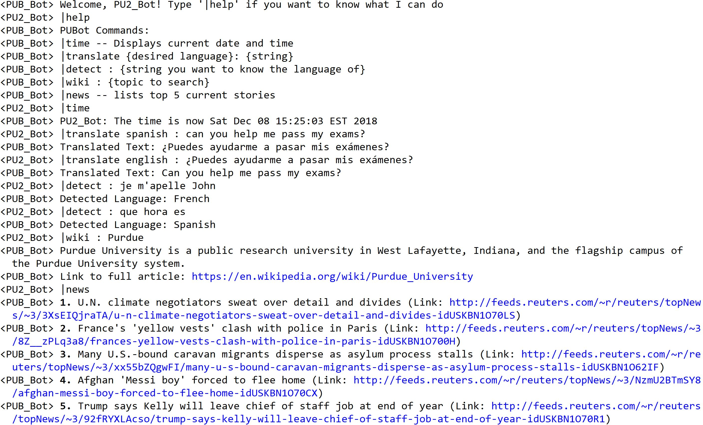

# IRC Chat Bot Made Using the [Pircbot Java Framework]

## How to Build:

  * Download code
  * Install Gradle if not installed
    * [Gradle Releases](https://gradle.org/releases/)
    * [Installation](https://gradle.org/install/)
  * From command line:
    * navigate to directory with the _gradlew_ file (this is the Gradle wrapper)
    * Run __./gradlew build__ (this will build/compile the code)
    * Run __./gradlew run__ (this will start the bot)

## How to Use:

  * Download an IRC client
    * I used [mIRC](https://www.mirc.com/get.html), which gives you a free 30 day trial
  * Within the __PU_BotMain.java__ file:
    * Change line 15 (bot.connect) to your desired IRC server
    * change line 24 (bot.joinChannel) to your desired channel
  * You can change the bot's nickname at line 44 of __PU_Bot.java__
  * Rebuild and rerun the code if you make any changes
  * From the IRC client, join the channel that you set your bot to join to use/test it

## Bot Commands

* __|help__ -- Displays help message
* __|time__ -- Displays current time
* __|translate [desired language]: [string]__ -- Translates string into designated desired language
* __|detect [string]__ -- Detects the language of the input string
* __|wiki: [topic]__ -- Gives a summary of the topic from Wikipedia, along with a link to the full article
* __|news__ -- Lists the current top 5 news story headlines along with links to full articles from Reuter's website

## Demo

[Pircbot Java Framework]: http://www.jibble.org/pircbot.php
